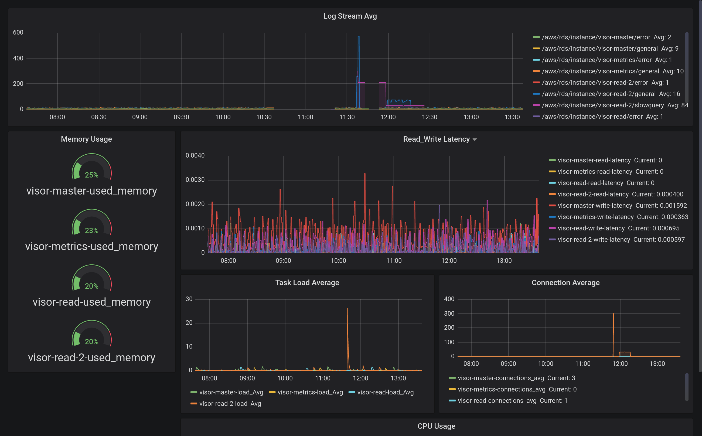
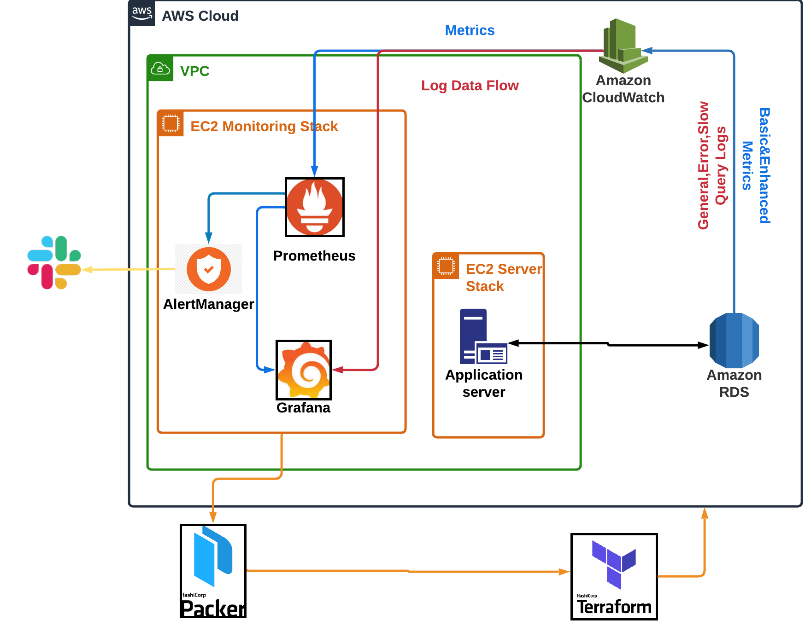

# RDS Monitoring and performence analysis:

This project is a full monitoring stack that starts an EC2 instance that can monitor the your RDS MySQL clusters with [Enhanced Monitoring](https://docs.aws.amazon.com/AmazonRDS/latest/UserGuide/USER_Monitoring.OS.html)
metrics as well as RDS slow-query and error log flow. 

[Prerequisite](#prerequisite)

[Monitoring DashBoard](#monitoring-dashboard)

[System Architechture](#system-architecture)

[CodeBase](#code-base)

[RunningTheCode](#run-the-code)

## Prerequisite:

To make the whole system work, you need to install `Terraform` and `Packer`
from HashiCorp.

Follow these instructions if you are new to these tools:

[Terraform Start](https://www.terraform.io/downloads.html)

[Packer Start](https://www.packer.io/intro/getting-started/build-image.html)

## Monitoring DashBoard:

This is a example of how the dashboard looks like:



The dashboard includes all critical part for monitoring RDS dataset traffic. It includes the RDS-traffic monitoring,
the CPUUsage, the average task load, the general log input flow and the average connection. Each of them can show some 
aspect of the RDS traffic, combined together will give you a high level view of the whole traffic. The memory simply 
shows the memory usage. The read/write latency is a key fact for system health. The log stream can help engineer locate 
the instance that goes wrong and refer to the problematic instance quickly.


## System Architecture:



The whole system is built on aws, and launched by Terraform. The system first connects RDS and let RDS feed all metrics
to CloudWatch. We then can hook data out of CloudWatch using [rds_exporter](https://github.com/percona/rds_exporter) and
[cloudwatch_exporter](https://github.com/prometheus/cloudwatch_exporter). By utilizing these exporters, [Prometheus](https://prometheus.io/) is 
able to get all needed data then feed into its great partner [Grafana](https://grafana.com/) for visualization, finally,
[Alertmanager](https://prometheus.io/docs/alerting/alertmanager/) will take care and fire alerts. 

## Code Base:

My code structure follows this flow:

```
Project
|
|---README.md
|
|---configs
|   |...
|
|---templates
|   |...
|
|---Terraform_Scripts
|   |
|   |---dev
|   |
|   |---modules
|   |   |
|   |   |---db_parameter_group
|   |   |   |...
|   |   |---monitoring_ec2
|   |   |   |...
|   |   |---rds
|   |   |   |...
|
|...
```

Where configs and templates saves scripts and configuration files for packer to create 
a new AWS AMI. If you want build a similar image as I do, please check section [Packer_Config](#configuring-your-own-packer). The 
Terraform Scripts contains all the modules I launched using Terraform.

## Run The Code:

### Before We Start:

Before we start, make sure you configure your credential variables for AWS following this instruction: 
[Credential Set Up](https://docs.aws.amazon.com/sdk-for-java/v1/developer-guide/setup-credentials.html). (Don't Hard Code
 them in your code!)
 
### Setting Up IAM Roles:

To make the whole system running smoothly, I recommend you to add these IAM policies to your IAM User:
`AmazonRDSFullAccess`, `AmazonRDSEnhancedMonitoringRole`, a new policy for rds_exporter:

```
{
    "Version": "2012-10-17",
    "Statement": [
        {
            "Sid": "Stmt1508404837000",
            "Effect": "Allow",
            "Action": [
                "rds:DescribeDBInstances",
                "cloudwatch:GetMetricStatistics",
                "cloudwatch:ListMetrics"
            ],
            "Resource": [
                "*"
            ]
        },
        {
            "Sid": "Stmt1508410723001",
            "Effect": "Allow",
            "Action": [
                "logs:DescribeLogStreams",
                "logs:GetLogEvents",
                "logs:FilterLogEvents"
            ],
            "Resource": [
                "arn:aws:logs:*:*:log-group:RDSOSMetrics:*"
            ]
        }
    ]
}
```

A new policy for cloudwatch_exporter:

```
{
    "Version": "2012-10-17",
    "Statement": [
        {
            "Sid": "AllowReadingMetricsFromCloudWatch",
            "Effect": "Allow",
            "Action": [
                "cloudwatch:DescribeAlarmsForMetric",
                "cloudwatch:ListMetrics",
                "cloudwatch:GetMetricStatistics",
                "cloudwatch:GetMetricData"
            ],
            "Resource": "*"
        },
        {
            "Sid": "AllowReadingTagsInstancesRegionsFromEC2",
            "Effect": "Allow",
            "Action": [
                "ec2:DescribeTags",
                "ec2:DescribeInstances",
                "ec2:DescribeRegions"
            ],
            "Resource": "*"
        },
        {
            "Sid": "AllowReadingResourcesForTags",
            "Effect": "Allow",
            "Action": "tag:GetResources",
            "Resource": "*"
        }
    ]
}
```

### Configuring Your Own Packer:

To configure your config, you need to know the tools we used for Rthe monitoring stack. I used `Prometheus`, along
with `rds_exporter`, `Cloudwatch_exporter`. To config the prometheus, you need to change `prometheus.yml` in config fold
please check [Prometheus_Configuration](https://prometheus.io/docs/prometheus/latest/configuration/configuration/) for 
more information; Besides, to add alert rules to the Prometheus, you would like to refer to [Alert_Rules](https://prometheus.io/docs/prometheus/latest/configuration/alerting_rules/)
and change the `alert_rules.yml`. 

To config `rds_exporter`, change `config.yml` as shown in [RDS_Exporter](https://github.com/percona/rds_exporter), 
to config `alertmanager`, change `alertmanager.yml` following the [Alertmanager](https://prometheus.io/docs/alerting/alertmanager/). 

The last step before starting the node, please set up `AWS_ACCESS_KEY_ID` and
`AWS_SECRET_ACCESS_KEY`.

After configuring all the files, follow the following step:

```shell script
cd ./templates 
packer validate example.json
packer build example.json
```

Then you get your own AMI image for the unique monitoring stack!

### Startup the whole system:

To start up the whole system, you need to change the image and owner of the 
AMI in `Terraform_Scripts/modules/monitoring_ec2/main.tf` to your own AMI created.

Then please do the follow the following steps:

```shell script
cd ./Terraform_Scripts/dev
terraform init
terraform plan
terraform apply
```

### Configuring EC2 Instance:

After spinning up all the instances, we need to set up the EC2 instance to run the monitoring stack.

Refer to the `move_configs.sh` and move and configuration to the right place.

Then add  `AWS_ACCESS_KEY_ID`, `AWS_SECRET_ACCESS_KEY` to your system.

Config your go by:

```shell script
export GOPATH=$HOME/go
export PATH=$PATH:/usr/local/go/bin
export GOROOT=/usr/local/go
```


### Launching The Dashboard:


At last run:

```shell script
sudo systemctl start cloudwatch_exporter
sudo systemctl start rds_exporter
sudo systemctl start alertmanager
```

Then check your grafana at `localhost:3000` and launch the 
same dashboard as mine using the template `grafana_dashboard.json`! 